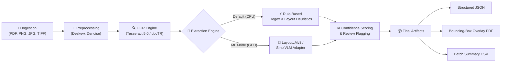

# 📄 DocuExtract AI: Enterprise Multimodal Document Extraction Engine

<div align="center">

[](https://fastapi.tiangolo.com/)
[](https://www.python.org/)
[](https://github.com/tesseract-ocr/tesseract)
[](https://colab.research.google.com/github/Shyamsundar2203/invoice-legal-extraction/blob/main/DocuExtract_AI_Colab.ipynb)
[](LICENSE)

**An intelligent, production-ready document extraction platform designed to ingest messy, multi-format financial invoices and complex legal agreements, converting unstructured scans into validated JSON schemas, bounding-box visual overlays, and human-in-the-loop audit logs.**

[🚀 1-Click Google Colab](#-google-colab-1-click-run) • [💻 Live Local Demo](#-live-web-demo--quick-start) • [🏛️ Architecture](#%EF%B8%8F-pipeline-architecture) • [📡 API Reference](#-rest-api-contract) • [🌐 Cloud Deployment](#-free-global-public-link-sharing)

</div>

---

## 💡 Why DocuExtract AI?

Traditional OCR tools merely transcribe character strings without comprehending spatial layout, tabular hierarchy, or semantic meaning. **DocuExtract AI** bridges raw computer vision and structured business intelligence:

- 🧾 **Financial Documents**: Extracts complex header fields (Vendor, Buyer, Tax IDs, Invoice #, Payment Due Dates, Totals) alongside granular, multi-row line item tables with price and quantity parsing.
- 📜 **Legal Contracts & MSAs**: Extracts contracting parties, effective terms, governing laws, and flags critical clauses (*Termination, Confidentiality, Indemnification, Liability Limits*).
- 🛡️ **Confidence Calibration & Human-in-the-Loop**: Calibrates optical and semantic extraction scores to automatically flag low-confidence (<85%) fields for human audit.
- 🎨 **Visual Bounding-Box Overlay**: Generates layered PDFs displaying exact spatial bounding boxes for visual verification.
- ⚡ **Zero-GPU Baseline + ML Ready**: Runs instantly on standard CPU hardware via rule-based heuristics, with a plug-and-play adapter to swap in fine-tuned **LayoutLMv3** or **SmolVLM** vision-language models.

---

## 🏛️ Pipeline Architecture



---

## 📁 Project Structure

```text
invoice-legal-extraction/
├── backend/
│   ├── app/
│   │   ├── pipeline/          # Core Processing Pipeline
│   │   │   ├── preprocess.py  # Page deskewing, rotation correction & cleaning
│   │   │   ├── ocr.py         # Cross-platform OCR engine wrapper
│   │   │   ├── extract.py     # Heuristic and ML entity extraction engines
│   │   │   ├── confidence.py  # Confidence calibration & human-review flagging
│   │   │   ├── overlay.py     # High-resolution visual PDF overlay generator
│   │   │   └── orchestrator.py# End-to-end execution coordinator
│   │   ├── routers/           # FastAPI API Endpoints
│   │   │   ├── extract.py     # POST /extract & GET /extract/{id}/overlay
│   │   │   └── batch.py       # POST /batch & GET /batch/summary.csv
│   │   ├── config.py          # Central environment configuration
│   │   ├── schemas.py         # Strict Pydantic contracts
│   │   └── main.py            # Unified API & Static Web server
│   ├── tests/                 # Automated Pytest Suite
│   ├── scripts/               # OS setup utilities
│   ├── requirements.txt       # Production dependencies
│   └── Dockerfile             # Container configuration
├── frontend/                  # Modern Responsive Web Application
│   ├── index.html             # Clean UI markup & layout
│   ├── style.css              # Custom CSS design system (Dark mode, glassmorphism)
│   └── app.js                 # Event handlers & live visualizer
├── data/
│   ├── sample/                # Bundled test fixtures (sample_invoice.png, sample_contract.png)
│   ├── raw/                   # Ingested uploads
│   └── processed/             # Output JSON results and PDF overlays
├── training/                  # Custom Deep Learning Model Training
│   ├── train_layoutlmv3.py    # Fine-tune LayoutLMv3 token classifier
│   ├── train_smolvlm_invoice.py# Fine-tune SmolVLM visual-language model
│   ├── prepare_dataset.py     # SROIE & CUAD dataset formatters
│   ├── evaluate.py            # Precision, Recall & F1 benchmark evaluator
│   └── README.md              # Complete GPU training walkthrough
├── run_app.bat                # ⚡ 1-Click Windows Launcher
├── docker-compose.yml         # Containerized production stack
└── README.md                  # Project documentation
```

---

## 🚀 Live Web Demo & Quick Start

### ⚡ Option A: 1-Click Windows Launcher (Fastest)
If you are on Windows, simply double-click **[`run_app.bat`](run_app.bat)**:
- Automatically boots the unified FastAPI backend & frontend at **`http://127.0.0.1:8000`**
- Opens the application directly in your browser.

---

### 🐍 Option B: Manual Local Setup (Python)

#### 1. System Requirements
- **Python 3.10 to 3.12+**
- **Tesseract OCR Engine**:
  - **Windows**: [Download Tesseract 5.x Installer](https://github.com/UB-Mannheim/tesseract/wiki) *(Standard default path: `C:\Program Files\Tesseract-OCR`)*
  - **Debian / Ubuntu**: `sudo apt-get update && sudo apt-get install -y tesseract-ocr`
  - **macOS**: `brew install tesseract`

#### 2. Installation & Run
```bash
# Clone the repository
git clone https://github.com/Shyamsundar2203/invoice-legal-extraction.git
cd invoice-legal-extraction

# Install backend dependencies
cd backend
pip install -r requirements.txt

# Start the unified application
python -m uvicorn app.main:app --host 0.0.0.0 --port 8000 --reload
```
- **Web UI**: [http://127.0.0.1:8000](http://127.0.0.1:8000)
- **Interactive Swagger Docs**: [http://127.0.0.1:8000/docs](http://127.0.0.1:8000/docs)

---

### 🐳 Option C: Production Docker Setup
```bash
docker compose up --build
```

---

## 🌐 Free Global Public Link Sharing

You can deploy or share this pipeline globally for free so clients or teammates can access it from any browser:

### 1. Instant 1-Minute Live Tunnel (Serveo / SSH)
Generate a public HTTPS URL directly from your local terminal with no signups:
```bash
ssh -R 80:127.0.0.1:8000 -o StrictHostKeyChecking=no serveo.net
```
*Output will provide a live HTTPS link (e.g. `https://your-app.serveousercontent.com`) accessible from anywhere in the world.*

### 2. Free Cloud Hosting on Render.com
1. Fork or push this repository to GitHub.
2. Sign up for free at [Render.com](https://render.com) ➡️ **New Web Service**.
3. Select your repository, set the runtime to **Docker**, and click **Deploy**.
4. Render will automatically build the container and provide a 24/7 public URL (`https://your-extractor.onrender.com`).

---

## 🧪 Sample Document Verification Output

When ingesting the bundled `data/sample/sample_invoice.png`, the pipeline outputs structured entities in **~600ms**:

```json
{
  "document_id": "c09cc9d0",
  "filename": "sample_invoice.png",
  "doc_type": "invoice",
  "processed_at": "2026-08-17T10:29:44.533789",
  "processing_time_ms": 506.91,
  "overall_confidence": 0.65,
  "needs_review": true,
  "data": {
    "doc_type": "invoice",
    "invoice_number": { "value": "INV-2026-0458", "confidence": 0.7 },
    "invoice_date": { "value": "08/15/2026", "confidence": 0.7 },
    "due_date": { "value": "09/14/2026", "confidence": 0.7 },
    "vendor_name": { "value": "Acme Supplies Inc.", "confidence": 0.55 },
    "buyer_name": { "value": "Rajasthan Traders Pvt Ltd", "confidence": 0.55 },
    "subtotal": { "value": "450.00", "confidence": 0.7 },
    "tax_amount": { "value": "45.00", "confidence": 0.7 },
    "grand_total": { "value": "495.00", "confidence": 0.7 },
    "line_items": [
      { "description": "Widget A", "quantity": "10", "unit_price": "25.00", "total": "250.00", "confidence": 0.6 },
      { "description": "Widget B", "quantity": "5", "unit_price": "40.00", "total": "200.00", "confidence": 0.6 }
    ]
  },
  "overlay_pdf_path": "data/processed/c09cc9d0_overlay.pdf"
}
```

---

## 📡 REST API Contract

| Endpoint | Method | Params | Description |
| :--- | :--- | :--- | :--- |
| `/extract` | `POST` | `file` (multipart), `doc_type` (`invoice` \| `contract`) | Extracts structured key-values, line items, and clauses from a single file. |
| `/extract/{id}/overlay` | `GET` | `document_id` | Streams the visual bounding-box overlay PDF for visual verification. |
| `/batch` | `POST` | `files` (multipart array), `doc_type` | Asynchronously processes multiple files and returns an array of result schemas. |
| `/batch/summary.csv` | `GET` | — | Generates a consolidated summary CSV table of all processed documents. |
| `/health` | `GET` | — | Cluster health check & liveness probe. |

---

## 🔬 Automated Testing & Verification

Run the full pytest integration and unit test suite:
```bash
cd backend
python -m pytest tests/ -v
```

```text
collected 3 items
backend/tests/test_pipeline.py::test_invoice_number_extraction PASSED    [ 33%]
backend/tests/test_pipeline.py::test_contract_clause_detection PASSED    [ 66%]
backend/tests/test_pipeline.py::test_empty_document_flags_review PASSED  [100%]
============================== 3 passed in 0.96s ==============================
```

---

## 🧠 Fine-Tuning & ML Training

To train deep learning models on Google Colab or Kaggle (free GPU):
1. Navigate to [`training/`](training/README.md).
2. Download open datasets via `python prepare_dataset.py --dataset sroie`.
3. Train **LayoutLMv3**:
   ```bash
   python train_layoutlmv3.py --config configs/train_config.yaml
   ```
4. Fine-tune **SmolVLM (LoRA)**:
   ```bash
   python train_smolvlm_invoice.py
   ```
5. Plug the checkpoint path into `backend/app/config.py` by setting `EXTRACTION_BACKEND="ml"` and `CHECKPOINT_PATH="training/checkpoints/best"`.

---

## ⚖️ License
This project is open-source software licensed under the [MIT License](LICENSE).
